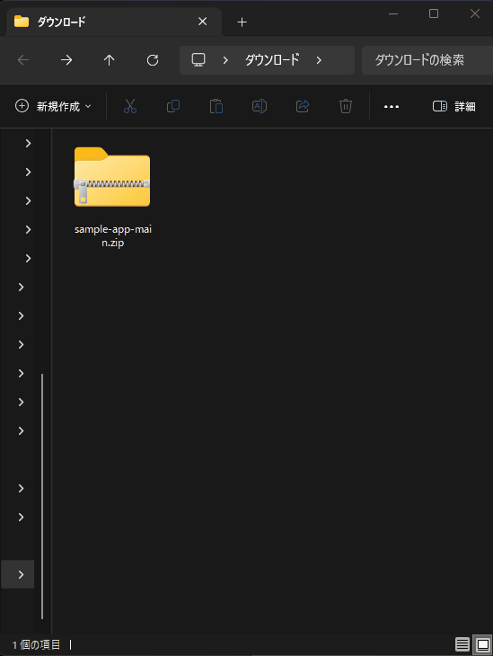
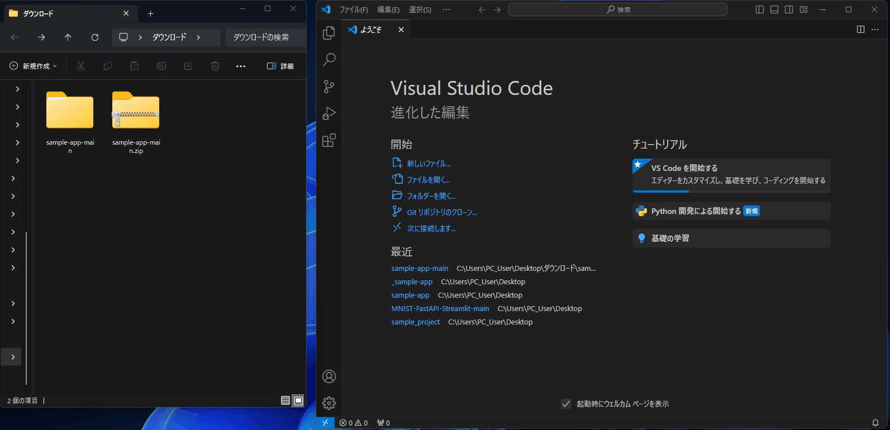
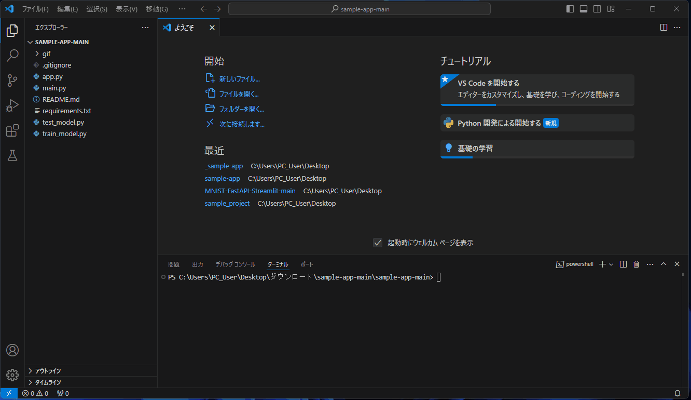
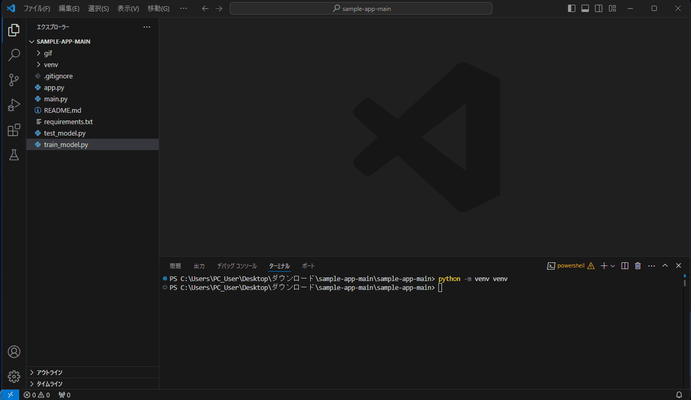
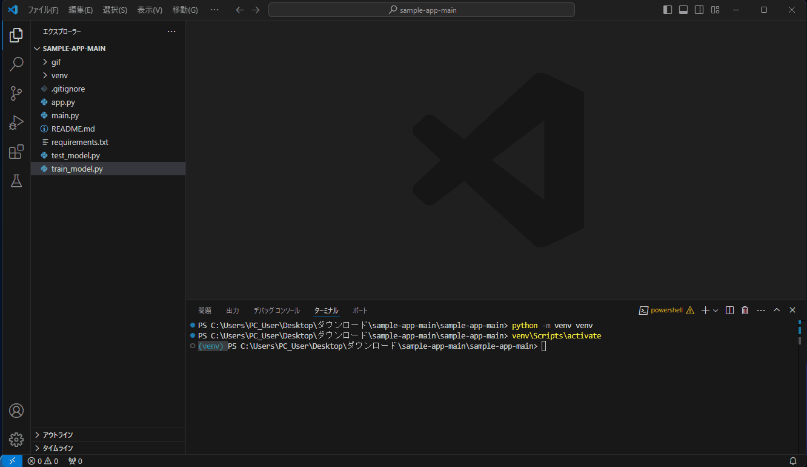
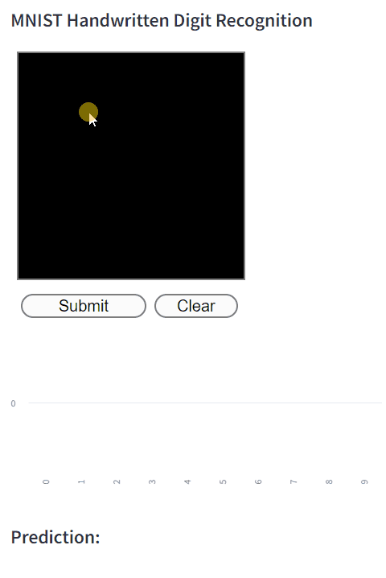

# MNIST-FastAPI-Streamlit

MNIST-FastAPI-Streamlitは、手書き数字認識を行うためのウェブアプリケーションです。  
MNISTデータセットでトレーニングされたモデルを使用し、StreamlitとFastAPIを使用して実際の手書き数字の識別を行うことが、このプロジェクトの主な目的です。

## 特徴
- **MNISTデータセット**を使用した手書き数字の認識
- **FastAPI**によるバックエンドAPIの構築
- **Streamlit**を使用したフロントエンドの開発

## 前提条件
このプロジェクトを実行するには以下が必要です：
- Python 3.10以上

## インストール方法
このプロジェクトを始める前に、以下の手順に従って必要な依存関係をインストールしてください。

### 1. Python 3.10のインストール:  
お使いのシステムにPython 3.10がインストールされていない場合は、[Python公式ウェブサイト](https://www.python.org/downloads/) からインストールしてください。  
インストール後、以下のコマンドを使用してPythonのバージョンを確認できます。

```bash
python --version
```

### 2. プロジェクトのダウンロード
1. 以下のリンクからプロジェクトをダウンロードしてください。  
[sample-app-main.zip](https://github.com/Gohei/sample-app/archive/refs/heads/main.zip)

2. ダウンロードしたzipファイルを解凍してください。


### 2. VSCodeでプロジェクトを開く ⛹️‍♂️
解凍した`sample-app-main`フォルダをドラッグドロップをして、VSCodeで開きます。


---

### 3. 仮想環境の作成 🔮
1. VSCode 画面上部のメニューから 表示 -> ターミナル ( View -> Terminal ) を選択してターミナルを表示します。
2. ターミナルで次のコマンドを入力して仮想環境を構築します。
```bash
python -m venv venv
```
このコマンドを実行すると、現在のフォルダに venv という名前のフォルダが作成されます。  




##### 注意事項 🚨
- 仮想環境（venvフォルダ）はGitリポジトリにコミットしないのが一般的です。  
仮想環境をコミットするとリポジトリの容量が大きく増加します。  
リポジトリの容量が大きくなるとサイズ制限やタイムアウトに起因する問題が発生するリスクが高まります。

- .gitignore ファイルを使用して、仮想環境を追跡対象から除外することをおすすめします。  
本リポジトリでも、.gitignoreファイルでvenvフォルダを除外しています。

---

### 4. 仮想環境の有効化 🪄
仮想環境を有効化します：
- Windowsの場合：
    ```bash
    venv\Scripts\activate
    ```
- macOS/Linuxの場合：
    ```bash
    source venv/bin/activate
    ```


---

### 5. 必要なライブラリのインストール 📚
仮想環境が有効になっていることを確認し、  
ターミナルで次のコマンドを入力して必要なライブラリをインストールします：  
**※完了までに数分かかる場合があります。**

```bash
pip install -r requirements.txt
```


---

## 使用方法
プロジェクトを実行するための主要なステップは以下の通りです：

### 1. モデルのトレーニング
MNISTデータセットを使用してモデルをトレーニングします。
```bash
python train_model.py
```

### 2. モデルのテスト
トレーニングされたモデルをテストします。
```bash
python test_model.py
```

### 3. FastAPIサーバーの起動
バックエンドAPIサーバーを起動します。
```bash
python main.py
```

### 4. Streamlitフロントエンドの起動
Streamlitを使用したフロントエンドを起動します。
```bash
streamlit run app.py
```


## License
This project is licensed under the MIT License - see the LICENSE file for details.